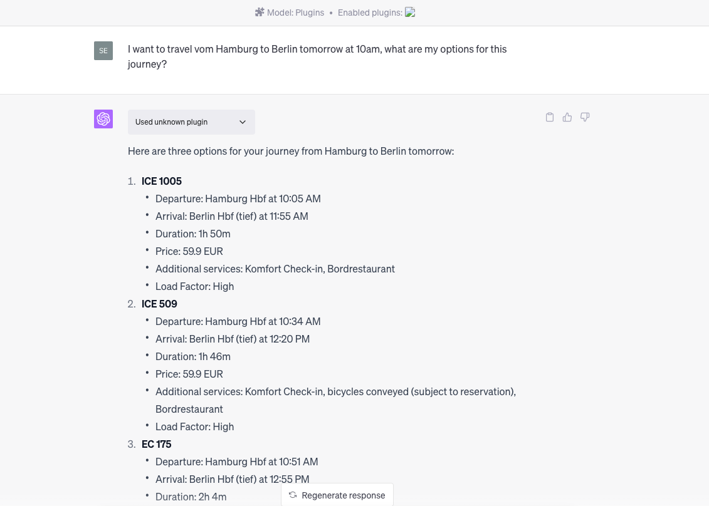

# Open AI Plugin for German Public Transport

This is a simple, mostly generated OpenAI plugin, which wraps this (inoffical) [API](https://v6.db.transport.rest/api.html) for German public transport journey planning. That's real live data, apparently exactly the same data which the [DB Navigator](https://www.bahn.de/service/mobile/db-navigator) is using. Thanks to [Vikram](https://github.com/vikramsg) for bringing it up that this API exists. 

This was done as part of the [Machine Minds Hackday](https://www.meetup.com/machine-minds-hamburg/events/293740181/).

## Getting started

You'll have to have a premium subscription of OpenAI to use plugins in ChatGPT. Read more about plug in development [here](https://platform.openai.com/docs/plugins/getting-started)

As described in these docs, it's possible to use it from localhost. So really all you have to do is run the following:

```
npm install
node index.mjs
```

And follow [these](https://platform.openai.com/docs/plugins/getting-started/running-a-plugin) instructions to test the plugin.

## Screenshot


